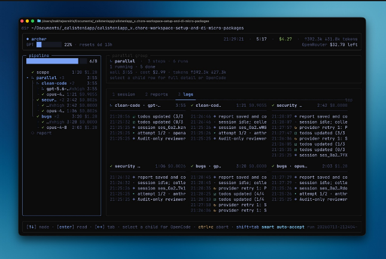

# Swarm TUI — Feature Brief

## Goal and context

A terminal dashboard to monitor and navigate the SwarmForge 4-agent swarm
(specifier, coder, reviewer, architect). Launched as `./swarm tui`, it runs
standalone in the current terminal, shows live per-agent status, and lets the
user attach into any agent's tmux session to watch or help.

Facts established by repository exploration:

- The swarm runs one tmux session per role named `swarmforge-<role>` on a
  private socket whose path is in `.swarmforge/tmux-socket`.
- `.swarmforge/roles.tsv` maps role → worktree path, session, display name.
- Per-role handoff state lives under `<worktree>/.swarmforge/handoffs/`:
  `inbox/new/` (queued), `inbox/in_process/` (working, max 1), and
  `in_process/completed` history. Handoff files carry RFC822-style headers
  (`task:`, `created_at`, `dequeued_at`, `completed_at`, ...).
- The repo has no JS/TS tooling: no package.json, no node_modules. Node
  v26.4.0 is on PATH; bun/deno are not. The constitution forbids installing
  anything from a remote registry.
- Cost/usage tracking is greenfield; nothing exists.

## Decisions settled with the user

- **Stack**: zero-dependency TypeScript on Node 26 (native type-stripping,
  hand-rolled ANSI renderer). No npm installs; repo stays hermetic.
- **Location**: isolated folder `tui/` at repo root; launched via a new
  `./swarm tui` subcommand. It does NOT spawn its own tmux session.
- **Navigation**: Enter on an agent attaches the current terminal to
  `swarmforge-<role>` via the private socket (child process). Leaving the
  agent view uses the native tmux detach `C-b d`; the child exits and the TUI
  resumes at the dashboard. No custom hotkeys (no Ctrl+Q / Ctrl+Shift+Q).
- **Menu bar**: `[dashboard] [specifier] [coder] [reviewer] [architect]
  [logs] [costs]`. "Log out" of an agent = back to dashboard; `q` quits the
  TUI entirely and restores the terminal.
- **Status model** (from handoff state, polled every 1s, same cadence as
  handoffd):
  - spinner = working (`inbox/in_process/` non-empty)
  - dot = finished-idle (has completed tasks, nothing queued or in process)
  - `!` = needs human (a pending `to: user` note)
  - blank = idle (never worked / nothing completed)
  - working rows also show the current task name from the handoff `task:`
    header.
- **Input**: keyboard only (arrows/enter + footer hints). Mouse later if
  needed.
- **Feature chain**: F1 dashboard → F2 navigation polish → F3 human-help
  requests → F4 logs window → F5 costs/usage monitor. This brief covers the
  whole chain; only F1 is specified in Gherkin now.
- **F3 (deferred)**: extend handoff protocol with `to: user` notes; TUI shows
  the `!` badge; the user answers by attaching and typing.
- **F4 (deferred)**: tabbed logs — per-agent scrollback via
  `tmux capture-pane` plus a global handoff-events feed.
- **F5 (deferred)**: per-agent session totals + per-task breakdown; opencode
  first (3 of 4 roles), codex best-effort, `n/a` where no source; no budget
  alerts.

## F1 scope (specified now)

Left agents panel (4 roles, status marker + task name), right detail pane for
the selected agent (task, state, handoff timestamps, recent events), top menu
bar with logs/costs shown disabled, footer with keybindings. Enter attaches;
`C-b d` returns; `q` quits. Specified in:

- `features/swarm-tui-dashboard.feature` — display, status, navigation.
- `features/swarm-tui-resilience.feature` — degraded conditions (no swarm,
  lost socket, small terminal, missing/malformed state).

### Design reference

Layout inspiration only (not a pixel spec): dark theme, left tree panel with
live status/timers, right detail and event area, top header bar with session
stats, bottom footer with keybinding hints. Map it to our chrome: left agents
panel + right session detail + menu bar + footer. The multi-pane log grid and
reports/logs tabs belong to F4, not F1.

## Edge cases and error handling

- Swarm not running at startup, or socket lost while running → error screen
  telling the user the swarm is unavailable; no crash.
- Terminal smaller than 100x30 → "terminal too small" screen showing current
  vs required size; recovers automatically on resize.
- Missing or malformed agent state files → that agent renders with a blank
  status; the TUI does not crash.
- Agent tmux session ends unexpectedly while attached (e.g. "server
  disconnected unexpectedly") → the TUI returns to the dashboard and shows a
  non-transient error message with the session termination reason, instead of
  silently resuming. The underlying session-lifecycle cause is out of the TUI's
  scope and is tracked separately.

## Non-functional constraints

- Zero runtime dependencies; TypeScript executed by Node's native
  type-stripping (no build step required to run).
- Tests with the built-in `node:test` runner.
- 1s status polling; rendering must keep up with that cadence.
- Minimum terminal 100x30; WSL terminal is the first target.
- Keyboard-only input.

## Non-goals (F1)

- Mouse support, log viewing, cost/usage data, human-help protocol changes,
  running as a tmux session, auto-start with the swarm, Windows-native
  terminals, managing multiple swarms.

## Open questions

- None. Codex usage-file format (F5) and extended-key support (dropped) will
  be revisited when those features are specified.
